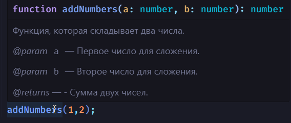

# Написание кода JS

В данной главе мы постараемся рассмотреть основы написания кода на JavaScript и ответить на наиболее часто задаваемые вопросы. Тебя никогда не волновал вопрос, а нужна ли в конце строки точка с запятой?

## Самое начало

Для начала открой любой текстовый редактор кода, консоль в браузере или другое подходящее для тебя средство (подробнее, см. [Введение](../01_intro/11_intro.md)).

Теперь давайте разберемся, с чего стоит начать, чтобы освоить JavaScript. В языке программирования JS выделяются три ключевых аспекта, понимание которых облегчит тебе последующее изучение:

1. Выражения
2. Функции
3. Объекты

Позже мы более подробно рассмотрим функции и объекты. Сейчас давайте сосредоточимся на понимании выражений.

## Выражения

> [!NOTE]
> Выражение — сущность языка JS (фрагмент кода), который возвращает значение.

Рассмотрим пару примеров выражений в JS.
```js
10 // результат выражения будет равен числу 10
20 + 30  // Результат выражения будет равен числу 50.
'Hello' + 'World' // Результат выражения будет строкой 'Hello World'.
x = 3  // Результат выражения - значение, которое вы присваиваете переменной, то есть число 3.
func(a) //  // Результат выражения зависит от возвращаемого значения функции func с аргументом a.
v >= a // Результат выражения будет логическим значением (true или false) 
```
Попробуй открыть консоль разработчика и ввести одну из представленных выше строк. Вернулся ли результат?

Также существуют выражения с побочными эффектами - это выражения, которые не только возвращают значение, но и выполняют другие действия. Например,
```js
x = 3 // присваивание значения переменной x
x++ // увеличение значения переменной x на 1
func(a) // вызов функции func с аргументом a
```
Эти выражения не только возвращают значения, но также изменяют состояние переменных или выполняют другие действия.

## Инструкции

Инструкции в некотором роде аналогичны выражениям. В отличие от выражений, которые возвращают значения, инструкция выполняет определенное действие.

> [!NOTE]
> Инструкции представляют собой синтаксические конструкции и команды, которые выполняют определенные действия.

Инструкции обычно оформляются с новой строки, при этом в конце каждой инструкции ставится точка с запятой.

Например,
```js
alert("Hello"); // вызов функции `alert` для отображения сообщения
let a; // создание переменной 
let b = 3; // создание константы b и присвоение ей значения 3
b = 6; // присвоение переменной b числа 6
if (3 > 2) {  // условная конструкция if для проверки условия
    console.log("Hello, world");
}
```
Приведенные выше примеры представляют собой инструкции, которые выполняют определенные действия, такие как создание переменной и вызов функции.

Как мы можем заметить, одним из примеров выше является также выражение `b = 6`. В данном случае это `выражение-инструкция`. Оно выполняет действие, а также возвращает некоторое значение.

В принципе, нет ничего сложного; главное — найти ту тонкую грань между этими понятиями. 

## Точка с запятой `;`

После того как мы разобрались с выражениями и инструкциями, давайте обсудим использование точки с запятой. Как ты считаешь, необходимо ли её ставить после каждой строки?

> [!NOTE]
> В языке JS точка с запятой является необязательной.

Но почему точка с запятой необязательна? Ответ прост: парсер JavaScript с использованием инструмента Automatic Semicolon Insertion (ASI) автоматически вставляет точку с запятой за вас. То есть, после того, как вы запускаете код, если точка с запятой отсутствует, парсер самостоятельно добавляет её в соответствующие места для обеспечения корректной работы.

Однако существуют ситуации, когда парсер может пропустить точку с запятой там, где её ожидание может привести к ошибкам в интерпретации кода.  Пока не будем вдаваться в эти тонкости, чтобы не усложнять понимание. Просто доверьтесь.

Существует несколько плюсов и минусов.

| Плюсы использования точек с запятой в JavaScript                                                                                          | Минусы применения точек с запятой в JavaScrip                                                                                             |
|-------------------------------------------------------------------------------------------------------------------------------------------|-------------------------------------------------------------------------------------------------------------------------------------------|
| Предсказуемость кода: Явное указание на конец инструкции делает код более предсказуемым и уменьшает вероятность ошибок.                   | Избыточность: В некоторых случаях точки с запятой могут показаться избыточными, особенно когда автоматическая вставка работает корректно. |
| Совместимость: Некоторые инструменты и среды разработки могут лучше взаимодействовать с кодом, в котором точки с запятой использованы явно. | Эстетика: Для некоторых разработчиков отсутствие явных точек с запятой делает код более читаемым и эстетичным.                            |
| Читаемость (дела вкуса)                                                                                                                   | Лишний символ:  экономия времени и места                                                                                                  |
 | Дело привычки: Ты привык пользоваться точкой с запятой.                                                                                   | Автоматическая вставка: точка запятой и так вставляется автоматически                                                                     |

Исходя из представленной таблицы, можно заключить, что существуют как плюсы, так и минусы использования точек с запятой в коде. Лично я предпочитаю их использовать. Хоть многие и рекомендуют ставить точку с запятой, однако я рекомендую тебе самому написать код с использованием и без использования точек с запятой, а затем принять решение, что для тебя более предпочтительно.

## Комментарии

Очень часто возникает необходимость комментировать различные фрагменты кода, свои функции или места, где требуется внести изменения.

> [!NOTE]
> Комментарии не влияют на выполнение скрипта.

> [!IMPORTANT]
> Комментирование кода — залог понимания и поддержания программного кода в будущем. Комментарии помогают не только тебе, но и другим разработчикам разбираться в логике работы программы, особенно если она будет развиваться или поддерживаться коллективом. Не стесняйся добавлять комментарии для пояснения сложных частей кода или описания намерений.

Существуют три вида комментариев:

1. Однострочные комментарии.
2. Многострочные комментарии.
3. JSDoc

Давай немного детальнее рассмотрим каждый из примеров.

### Однострочные комментарии

Однострочные комментарии используются для вставки пояснений или описания кода. Это может включать в себя краткое пояснение к какой-то инструкции или переменной.

Односточные комментарии в JS начинаются с `//`

```js
let total = 0; // Итоговая сумма
let taxRate = 0.1; // Ставка налога
```

### Многострочные комментарии

Многострочные комментарии используются для вставки более развернутых пояснений, описаний функций, или для временного исключения блока кода из выполнения. Этот тип комментариев может охватывать несколько строк кода и обычно используется для предоставления подробной документации к части программы.

Чаще они применяются для предоставления более подробного пояснения к определенному участку кода.

```js
/*
 Этот блок кода временно исключен из выполнения,
 так как он вызывает ошибку в текущей среде.
*/
// someCode();

function processUserData(user) {
    /*
      Проверка, является ли пользователь
      администратором, и соответственно настраиваем
      его права и доступы.
    */
    if (user.isAdmin) {
        // настройка прав администратора
    } else {
        // настройка прав обычного пользователя
    }
}
```

### JSDoc

JSDoc является важным форматом для документирования кода (о документации мы поговорим в отдельной части нашего пособия).

JSDoc - это стандарт для документирования кода на JavaScript с использованием специального синтаксиса комментариев. Он предоставляет возможность создания структурированной и подробной документации, которая может быть использована для автоматической генерации документации с помощью различных инструментов.

```js
/**
 * Функция, которая складывает два числа.
 * @param {number} a - Первое число для сложения.
 * @param {number} b - Второе число для сложения.
 * @returns {number} Сумма двух чисел.
 */
function addNumbers(a, b) {
  return a + b;
}

```
Это позволяет многим интегрированным средам разработки (IDE) автоматически подсвечивать или выводить подсказки (Рисунок ниже).  Также, с помощью специальных инструментов, ты сможешь генерировать документацию в формате HTML на основе этих комментариев, что значительно упрощает процесс создания и поддержки документации к проекту.


