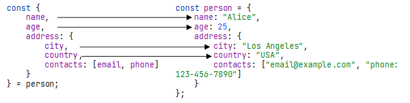

# Деструктуризация объектов

В [главе 4.2](../04_arrays/42_destructuring_spread_operator.md) мы подробно обсудили, что представляет собой деструктуризация и где она находит применение. Мы рассмотрели деструктуризацию в контексте массивов в JS. Учитывая, что массивы являются объектами, мы также можем деструктуризировать обычные объекты.

## Синтаксис

Синтаксис деструктуризации объектов.

`const {property1, property2} = {property1: ..., property2: ...}`

То есть, мы выполняем те же самые действия, что и при работе с массивами. В контексте объекта мы извлекаем его свойства в другие переменные.

```js
const car = {
    brand: "toyota",
    model: "auris",
    year: 2015,
}

// деструктуризируем объект
const {brand, model, year} = car;
console.log(brand, model, year); // toyota auris 2015
```

### Переименование свойств

Часто возникает необходимость присвоить свойство переменной другое имя. Например, вместо переменной `brand` мы могли бы использовать переменную `b`. В таких случаях мы можем осуществлять "_переименование_" переменных при деструктуризации объектов.

```js
const car = {
    brand: "toyota",
    model: "auris",
    year: 2015,
}

const {brand: b, model: m, year} = car;
// brand -> b
// model -> m

console.log(b, m, year); // toyota auris 2015
```

Такой подход часто используется, 
* Для более ясного и краткого обозначения переменных, особенно когда их имена слишком длинные или неинформативные.
```js
function getOrderInfo() {
    // Возвращаем объект с информацией о заказе
    return {
        orderId: "123456",
        customerName: "John Doe",
        totalAmount: 100.50,
        shippingAddress: "123 Main St",
    };
}

// Деструктуризация объекта и переименование свойств
const {orderId: id, customerName: name, totalAmount: amount} = getOrderInfo();

console.log(id, name, amount); // 123456 John Doe 100.50
```
* Когда у нас уже есть переменная с определенным именем в коде, и мы хотим использовать другое имя для переменной, полученной из объекта при деструктуризации

```js
// Уже существующая переменная model
let model = "Camry";

// Объект, из которого мы хотим извлечь свойство
const car = {
    model: "Corolla",
};

// Деструктуризация объекта с переименованием переменной
const { model: carModel } = car;

console.log(carModel); // Вывод: "Corolla"
console.log(model); // Вывод: "Camry"
```

### Значения по умолчанию

Как и в массивах, мы можем задавать значения по умолчанию для свойств объекта, если они отсутствуют.

```js
const car = {
    brand: "ford",
}

// Указываем значения по умолчанию
const {brand = "unknown", model = "unknown"} = car;

console.log(brand, model); // Вывод: ford unknown
```

### Остаточные параметры

Если нам необходимо извлечь определенные свойства, а остальные извлечь как один объект, мы можем воспользоваться оператором "..." (spread operator).

```js
const person = {
    name: "John",
    age: 30,
    country: "USA",
    employment: "Engineer"
};

// Извлекаем определенные свойства
const { name, age, ...otherInfo } = person;

console.log(name, age); // Вывод: John 30
console.log(otherInfo); // Вывод: { country: "USA", employment: "Engineer" }
```

## Вложенная деструктуризация

Часто нам приходится иметь дело с объектами, которые имеют вложенную структуру, где один объект содержит другие объекты или массивы. В таких случаях нам нужно уметь извлекать свойства именно из вложенных объектов.

```js
const person = {
    name: "Alice",
    age: 25,
    address: {
        city: "Los Angeles",
        country: "USA",
        contacts: ["email@example.com", "phone: 123-456-7890"]
    }
};

// Извлекаем свойства из вложенного объекта address и массива contacts
const { name, age, address: { city, country, contacts: [email, phone] } } = person;

console.log(name, age); // Вывод: Alice 25
console.log(city, country); // Вывод: Los Angeles USA
console.log(email, phone); // Вывод: email@example.com 123-456-7890
```


## Spread-оператор в объектах

Spread-оператор в объектах позволяет распространить (spread) свойства одного объекта в другой объект.

Этот оператор облегчает создание новых объектов, объединяя свойства из нескольких объектов в один.

```js
const defaults = {
    theme: 'light',
    fontSize: 12
};

const userPreferences = {
    fontSize: 16,
    fontFamily: 'Arial'
};

// Создаем новый объект, объединяя свойства из defaults и userPreferences
const mergedPreferences = { 
    ...defaults, 
    ...userPreferences 
};

console.log(mergedPreferences);
// Вывод: { theme: 'light', fontSize: 16, fontFamily: 'Arial' }
```

> [!NOTE]
> В этом примере, хотя свойство fontSize присутствует и в объекте `defaults`, и в объекте `userPreferences`, значение `fontSize: 16` из userPreferences перезаписывает значение fontSize: 12 из defaults.

Spread-оператор в объектах также позволяет создавать копии объектов с возможностью изменения или добавления новых свойств:

```js
const originalObject = { x: 1, y: 2 };

// Создаем копию объекта с добавлением нового свойства
const copyWithNewProperty = { ...originalObject, z: 3 };

console.log(copyWithNewProperty);
// Вывод: { x: 1, y: 2, z: 3 }
```

> [!NOTE]
> Этот подход копирования объектов удобен и предпочтителен в сравнении с использованием `Object.assign()`, особенно когда необходимо создать глубокие копии или работать с вложенными объектами.

Если свойства одинаковы в объектах, распространяемых с помощью spread-оператора, то значение из последнего объекта, распространяемого оператором, перезапишет значение из предыдущего объекта.