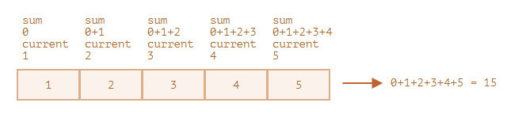

# Методы массивов

Работа с массивами в JavaScript является одной из ключевых задач. Вам постоянно придется выполнять итерации по массиву,
искать элементы и на основе одного массива генерировать другой.

Вы уже освоили методы преобразования данных с использованием циклов, таких как `for`, `while`, а также конструкций
типа `if...else`. Однако, что если я вам скажу, что существуют более выразительные, читаемые и удобные методы, которые
используются в JavaScript при работе с массивами.

Методы массивов также позволяют использовать функциональное программирование, что способствует разработке более
модульного и повторно используемого кода.

## Что такое метод?

**Метод** - это функция, привязанная к объекту.

Поскольку _массив является объектом_, он содержит различные методы.

Рассмотрим основные методы массивов.

## Метод `splice`

Метод `splice()` изменяет содержимое массива путем удаления существующих элементов и/или добавления новых.

### Синтаксис

```array.splice(start[, deleteCount[, item1[, item2[, ...]]]])```

* `start` - начальный индекс для изменения массива;
* `deleteCount` (необязательный) - количество удаляемых элементов (может быть 0);
* `itemN` (необязательный) - элементы для добавления.

### Возвращаемое значение

Метод `splice()` возвращает массив, содержащий удаленные элементы, если таковые были. Если ни один элемент не был
удален, возвращается пустой массив.

**Примеры**:

```js
const numbers = [1, 2, 3, 4, 5];
numbers.splice(2, 2); // Удалить 2 элемента, начиная с индекса 2
console.log(numbers); // [1, 2, 5]
```

```js
const fruits = ['яблоко', 'груша', 'апельсин'];
fruits.splice(1, 1, 'банан', 'киви'); // Заменить один элемент начиная с индекса 1 на 'банан' и 'киви'
console.log(fruits); // ['яблоко', 'банан', 'киви', 'апельсин']
```

```js
const fruits = ['яблоко', 'груша', 'апельсин'];
const removed = fruits.splice(1, 1, 'банан', 'киви');
console.log(removed); // [ 'груша' ]
```

## Метод `slice`

Метод `slice()` возвращает новый массив, содержащий копию указанной части исходного массива.

### Синтаксис

```arr.slice([begin[, end]])```

* `begin` (необязательный) — индекс, с которого начинается извлечение элементов. Если begin отрицателен, он указывает
  смещение от конца массива.
* `end` (необязательный) — индекс, по которой заканчивается извлечение элементов. Метод извлекает элементы с индексом
  _меньше end_. Если end отрицателен, он указывает смещение от конца массива. Если end больше или равен длине массива
  или не определен, извлекаются все элементы до конца массива.

### Возвращаемое значение

Метод `slice()` возвращает новый массив, содержащий указанные элементы.

### Примеры

```js
const fullList = ['item1', 'item2', 'item3', 'item4', 'item5'];
const displayedItems = fullList.slice(0, 3); // Срезать первые три элемента списка
console.log(displayedItems); // ['item1', 'item2', 'item3']
```

```js
const arr = [1, 2, 3, 4, 5];
const lastThreeItems = arr.slice(-3); // Извлечь последние три элемента массива
console.log(lastThreeItems); // [3, 4, 5]
```

## Метод `concat()`

Метод `concat()` возвращает новый массив, который состоит из элементов массива, к которому был применен этот метод,
объединенных с другими массивами и/или значениями, переданными в качестве аргументов.

### Синтаксис

```array.concat(value1[, value2[, ...[, valueN]]])```

* `valueN` — Массивы и/или значения, которые объединяются в новый массив.

### Примеры

```js
const array1 = [1, 2, 3];
const array2 = [4, 5, 6];
const newArray = array1.concat(array2);
console.log(newArray); //  [1, 2, 3, 4, 5, 6]
```

## Метод `indexOf()`

Метод `indexOf()` возвращает индекс **первого вхождения указанного элемента** в массиве, или -1, если такой элемент не
найден.

> [!NOTE]
> Метод `indexOf()` сравнивает искомый элемент searchElement с элементами массива, используя строгое сравнение (такое же
> сравнение, как и при использовании оператора ===).

### Синтаксис

```arr.indexOf(searchElement[, fromIndex = 0])```

* `searchElement` - элемент, который ищется в массиве.
* `fromIndex` (необязательный) - индекс, с которого начинается поиск. Если индекс больше или равен длине массива,
  возвращается -1. Если индекс отрицателен, интерпретируется как смещение с конца массива. Если рассчитанный индекс
  меньше 0, поиск производится по всему массиву. Значение по умолчанию - 0, что означает просмотр всего массива.

### Примеры

```js
let colors = ['красный', 'зеленый', 'синий'];
const searchTerm = 'зеленый';

// Определяем индекс искомого элемента в массиве
const index = colors.indexOf(searchTerm);

if (index !== -1) {
    colors.splice(index, 1); // Удалить элемент по его индексу
    console.log(`Элемент ${searchTerm} удален из массива.`);
} else {
    console.log(`Элемент ${searchTerm} не найден в массиве.`);
}
```

> [!TIP]
> Для проверки вхождения последнего индекса элемента в массиве используется метод `lastIndexOf()`.

## Метод `includes()`

Метод `includes()` проверяет, содержит ли массив определённый элемент, возвращая true, если элемент найден, и false в
противном случае.

### Синтаксис

```arr.includes(searchElement[, fromIndex = 0])```

* `searchElement` - элемент, который ищется в массиве.
* `fromIndex` - позиция в массиве, с которой начинается поиск элемента searchElement. Значение по умолчанию - **0**.

### Примеры

```js
[1, 2, NaN].includes(NaN); // true
```

```js
const fruits = ['яблоко', 'груша', 'апельсин'];
const searchTerm = 'груша';

// Проверяем, содержит ли массив fruits элемент searchTerm
if (fruits.includes(searchTerm)) {
    console.log(`Массив содержит ${searchTerm}.`);
} else {
    console.log(`Массив не содержит ${searchTerm}.`);
}
```

### Особенность `includes()`

> [!NOTE]
> Одной из особенностей метода `includes()` является его способность корректно обрабатывать значение `NaN`, в отличие от
> метода `indexOf()`.

```javascript
const array = [1, 2, NaN, 4, 5];

console.log(array.includes(NaN)); // Вернет true
console.log(array.indexOf(NaN));   // Вернет -1
```

## Метод `forEach()`

Метод `forEach()` выполняет указанную функцию один раз для каждого из элементов массива.

### Синтаксис

```array.forEach(function callback(currentValue[, index[, array]]) { ... })```

* `callback` — функция, вызываемая для каждого элемента массива, принимает три аргумента:
    * `currentValue` (текущий элемент)
    * `index` (индекс текущего элемента)
    * `array` (обрабатываемый массив).

### Возвращаемое значение

Метод `forEach()` возвращает [undefined](../02_basics/23_data_types.md).

### Примеры

```js
const products = ['Товар 1', 'Товар 2', 'Товар 3'];
// Проходим по каждому элементу массива products
products.forEach(product => console.log(product));
```

```js
const elements = document.querySelectorAll('.element');
elements.forEach((element, index) => {
    element.textContent = `Элемент ${index + 1}`;
});
```

```js
["Kate", "Michael", "Philip"].forEach((item, index, arr) => {
    console.log(`У ${item} в массиве ${arr}, оказывается индекс ${index}`);
});
```

### Сравнение с for

Для наглядности сравним один из вышеуказанных примеров с использованием цикла `for`:

```js
const elements = document.querySelectorAll('.element');
for (let i = 0; i < elements.length; i++) {
    elements[i].textContent = `Элемент ${i + 1}`;
}
```

Как вы думаете, который вариант более читаемый?

## Метод `find()`

Метод `find()` возвращает значение первого элемента массива, которое соответствует условиям, заданным в коллбэк-функции.
Если ни один элемент не удовлетворяет условиям, возвращается `undefined`.

### Синтаксис

```arr.find(function callback(currentValue[, index[, array]]) { ... })```

* `callback` — функция, вызываемая для каждого элемента массива, принимает три аргумента:
    * `currentValue` (текущий элемент)
    * `index` (индекс текущего элемента)
    * `array` (обрабатываемый массив).

### Примеры

```js
const numbers = [1, 2, 3, 4, 5];
// Использование метода find() для поиска первого четного числа в массиве
const evenNumber = numbers.find(number => number % 2 === 0);
console.log(evenNumber ? `В массиве есть четное число: ${evenNumber}` : `В массиве нет четного числа!`);
```

> [!TIP]
> Для того, чтобы найти последнее вхождение элемента в массиве, можно использовать метод `findLast()`.

## Метод `filter()`

Метод `filter()` создает новый массив, содержащий все элементы, которые прошли проверку, заданную в переданной функции

### Синтаксис

```array.filter(function callback(currentValue[, index[, array]]) { ... })```

* `callback` - это функция-предикат, которая применяется к каждому элементу массива. Если функция возвращает `true`,
  элемент сохраняется в новом массиве, если `false` - исключается из него.
    * `currentValue` (текущий элемент)
    * `index` (индекс текущего элемента)
    * `array` (обрабатываемый массив).

### Примеры

```js
const words = ['apple', 'banana', 'grape', 'orange', 'pineapple'];
// Фильтрация слов, начинающихся на букву 'b'
const bWords = words.filter(word => word.startsWith('b'));
console.log(bWords); // [ 'banana' ]
```

## Метод `map`

Метод `map()` создаёт новый массив, содержащий результат вызова указанной функции для каждого элемента исходного
массива.

### Синтаксис

```array.map(function callback(currentValue[, index[, array]]) { ... })```

* `callback` - это функция-предикат, которая применяется к каждому элементу массива. Если функция возвращает `true`,
  элемент сохраняется в новом массиве, если `false` - исключается из него.
    * `currentValue` (текущий элемент)
    * `index` (индекс текущего элемента)
    * `array` (обрабатываемый массив).

### Примеры

```js
const numbers = [1, 2, 3, 4, 5];
// Применяем метод map() к массиву чисел, вычисляя квадрат каждого числа
const squaredNumbers = numbers.map(number => number * number);
console.log(squaredNumbers); // [1, 4, 9, 16, 25]
```

```js
const fruits = ['Яблоко', 'Банан', 'Апельсин'];
const list = document.getElementById('list');
// Применяем метод map() к массиву строк, создавая HTML-элементы списка
const fruitItems = fruits.map(fruit => `<li>${fruit}</li>`);
// Обновляем содержимое списка HTML с помощью созданных элементов
list.innerHTML = fruitItems.join('');
```

## Метод `sort()`

Метод `sort()` осуществляет сортировку элементов массива на месте и возвращает отсортированный массив. Если функция
сравнения `compareFunction` не предоставляется, элементы сортируются путём их преобразования в строки и сравнения строк
в порядке следования кодовых точек Unicode.

Для строк используется лексикографический порядок, что может привести к неожиданным результатам, например, строка "2"
будет считаться больше строки "15".

### Синтаксис

```arr.sort([compareFunction])```

* compareFunction (необязательный) — Параметр, который указывает функцию, определяющую порядок сортировки.

### Условия compareFunction

Если предоставлена функция сравнения compareFunction, элементы массива сортируются в соответствии с ее возвращаемым
значением:

- Если `compareFunction(a, b)` меньше 0, a будет расположен перед b.
- Если `compareFunction(a, b)` равно 0, a и b останутся неизменными по отношению друг к другу, но будут отсортированы по
  отношению к другим элементам.
- Если `compareFunction(a, b)` больше 0, b будет расположен перед a.

> [!IMPORTANT]
> Функция `compareFunction(a, b)` должна всегда возвращать одно и то же значение для каждой пары элементов a и b, иначе
> порядок сортировки будет неопределенным.

### Примеры

```js
const numbers = [5, 2, 9, 1, 7];
// Функция сравнения принимает два числа a и b и возвращает результат их вычитания
// Это позволяет сортировать числа в порядке возрастания
numbers.sort((a, b) => a - b);
console.log(numbers); // Выведет: [1, 2, 5, 7, 9]
```

```js
const words = ['яблоко', 'апельсин', 'банан', 'груша'];
// Функция сравнения сортирует строки по убыванию их длины
words.sort((a, b) => b.length - a.length);
console.log(words); // ['апельсин', 'яблоко', 'груша', 'банан']
```

## Метод `reverse()`

Метод `reverse()` изменяет порядок элементов массива на месте. Первый элемент массива становится последним, а последний
элемент становится первым.

### Примеры

```js
const numbers = [1, 2, 3, 4, 5];
numbers.reverse();
console.log(numbers); // [5, 4, 3, 2, 1]
```

## Метод `reduce()`

Метод `reduce()` применяет функцию к каждому элементу массива, двигаясь слева направо, и возвращает одно результирующее
значение.

### Синтаксис

```array.reduce(function callback(accumulator, currentValue[, index[, array]])[, initialValue])```

* `callback` — функция, вызываемая для каждого элемента массива, принимает три аргумента:
    * `acc` (сохраняет значение, возвращаемое функцией callback после посещения каждого элемента, или initialValue)
    * `currentValue` (текущий элемент)
    * `index` (индекс текущего элемента)
    * `array` (обрабатываемый массив).

### Примеры

```js
const numbers = [1, 2, 3, 4, 5];
// Используем метод reduce() для суммирования всех элементов массива
const sum = numbers.reduce((accumulator, currentValue) => accumulator + currentValue, 0);
console.log(sum); // 15
```



```js
const items = ['apple', 'banana', 'orange'];
// Используем метод reduce() для создания списка элементов HTML
const htmlList = items.reduce((accumulator, currentValue) => accumulator + `<li>${currentValue}</li>`, '');
console.log(htmlList); // Выведет: '<li>apple</li><li>banana</li><li>orange</li>'
```

> [!TIP]
> Для обработки значений массива справа налево используйте метод `reduceRight()`. Используется когда необходим обратный
> порядок обработки.

## Метод  `join()`

Метод join() превращает элементы массива в строку, объединяя их, используя определенный разделитель.

### Синтаксис

```arr.join([separator])```

* `separator` (необязательный) — определяет строку, разделяющую элементы массива. Если не задан, используется
  запятая ','. При пустой строке элементы не разделяются.

### Примеры

```js
const fruits = ['apple', 'banana', 'orange'];
const result = fruits.join();
console.log(result1); // "apple,banana,orange"
```

```js
const colors = ['red', 'green', 'blue'];
const result = '<ul>' + colors.map(color => `<li>${color}</li>`).join('') + '</ul>';
console.log(result3); // "<ul><li>red</li><li>green</li><li>blue</li></ul>"
```

## Метод `every()`

Метод `every()` проверяет, удовлетворяют ли все элементы массива условию, заданному в переданной функции.

### Синтаксис

```arr.every(function callback(currentValue[, index[, array]]))```

* `callback` — функция, вызываемая для каждого элемента массива, принимает три аргумента:
    * `currentValue` (текущий элемент)
    * `index` (индекс текущего элемента)
    * `array` (обрабатываемый массив).

### Пример

```js
const words = ['apple', 'banana', 'cherry', 'date'];
const allLengthGreaterThan3 = words.every(word => word.length > 3);
console.log(allLengthGreaterThan3); // Выведет: false, так как не все слова имеют длину больше 3
```

## Keep learning ...

В главе рассмотрены лишь основные методы массивов, с которыми вам придется часто сталкиваться при работе с массивами в JavaScript. 

Для более детального изучения, рекомендуется обратиться к документации.