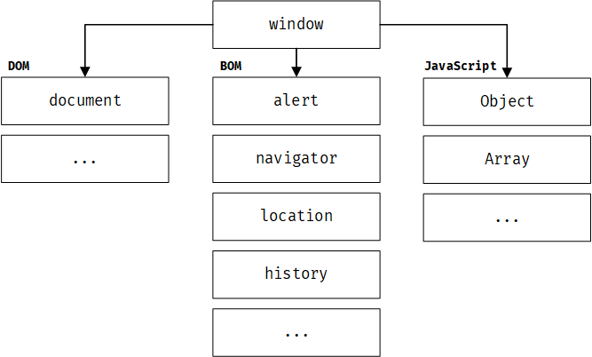
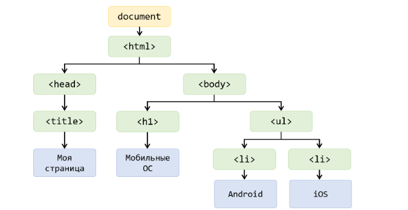

# Окружение Javascript

Изначально язык JavaScript разрабатывался для обеспечения взаимодействия с веб-сайтами, делая их динамичными и обновляя контент автоматически.

С развитием JavaScript его применение стало намного более разнообразным. В настоящее время он широко используется как полноценный язык программирования, способный даже на создание игр. Тем не менее его основная цель по-прежнему состоит во взаимодействии с HTML-разметкой с целью обеспечения динамичности.

Поэтому, в данном, и следующем модуле мы попробуем рассмотреть некоторые аспекты взаимодействия JS с браузерами и соответственно с HTML-разметкой.

## javascript окружение

Как уже упоминалось, JavaScript способен функционировать в различных **средах**: в веб-браузере, на сервере, и, вероятно, даже в вашей микроволновке. Однако следует учитывать, что в каждой из этих сред требуется разная функциональность. В веб-браузере мы можем управлять HTML элементами, в то время как, к примеру, в микроволновке мы можем управлять её работой, запуская или останавливая её функции.

Каждая из указанных сред, будь то веб-браузер, окружение вашего компьютера, или микроволновка, называется **окружением** выполнения javascript.

Однако, что представляет собой само окружение JavaScript? 

**Окружение** расширяет базовый набор функций и переменных языка, предоставляя **дополнительные возможности**. **Например**, окружение браузера добавляет функционал взаимодействия с браузером, в то время как Node.js расширяет возможности работы с файловой системой. Допустим, ваша микроволновка также может предоставить функции управления (включения и выключения), если бы в ней была поддержка JavaScript.

> [!TIP]
> Почему это происходит? Давайте **рассмотрим простой пример**. В Node.js мы не можем использовать функции для взаимодействия с HTML, поскольку Node.js предназначен для выполнения JavaScript на сервере или компьютере, где отсутствуют HTML-элементы. И наоборот, в браузере мы не можем использовать функции для доступа к файловой системе.


## Браузерное окружение

В данной главе мы будем говорить про браузерное окружение javascript и про его возможности. Именно это стало началом рождения языка JS.



`window` выполняет две основные роли:

1. Это глобальный объект, который хранит функции и переменные окружения.
2. Он представляет собой объект, представляющий окно браузера.

```js
// Пример использования функции окружения браузера
window.alert("Привет"); 

// Пример использования свойства window для получения информации об окне браузера
// В данном случае, выводится внутренняя высота окна браузера
console.log(window.innerHeight); 
```


Для просмотра всех свойств объекта window в консоли разработчика вы можете ввести следующую команду: `window;`

## Document Object Model

Чаще всего вы будете сталкиваться с понятием `DOM`, что означает `Document Object Model`, или модель объектов документа. 

Но что это такое и зачем оно нужно?

**Document Object Model** - это объектное представление HTML-страницы. Другими словами, это представление HTML-документа в виде древовидной структуры, где каждый элемент HTML-кода представлен в виде javascript объекта, позволяя JavaScript взаимодействовать с HTML-содержимым страницы, изменять его и управлять им.

Основным объектом является объект `document`, который представляет собой входную точку в работе с `DOM`.


_(схема взята с веб-ресурса itchief)_

Например, если нам нужно что-то изменить, мы обращаемся к свойствам объекта-элемента.

```js
// Изменить цвет текста в элементе `body` на черный (#000)
document.body.style.color = "#000";
```

# Browser Object Model

В окружении браузера существует **BOM** (Browser Object Model), который, в отличие от DOM, не оперирует HTML-элементами, а взаимодействует непосредственно с самим браузером.

Например,

1. Объект `history` позволяет управлять историей браузера, что включает в себя переходы между посещенными страницами и навигацию назад и вперед.
2. Объект `location` предоставляет информацию о текущем URL страницы и позволяет изменять URL или перенаправлять пользователя на другие страницы.

```js
// Пример использования объекта history для перехода на предыдущую страницу
history.back();

// Пример использования объекта location для получения текущего URL страницы
var currentURL = location.href;
console.log(currentURL);

// Пример использования объекта location для перенаправления пользователя на другую страницу
location.href = "https://www.example.com";
```

> [!TIP]
> Обратите внимание, что я не использую `window.history.back()`. В этом контексте все объекты и функции, связанные с `window`, могут быть использованы без обращения через глобальный объект `window`.

Также к части **BOM** относятся функции, которые мы рассмотрели выше, такие как хорошо знакомые `alert`, `prompt` и другие.