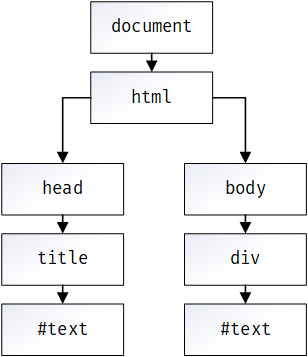
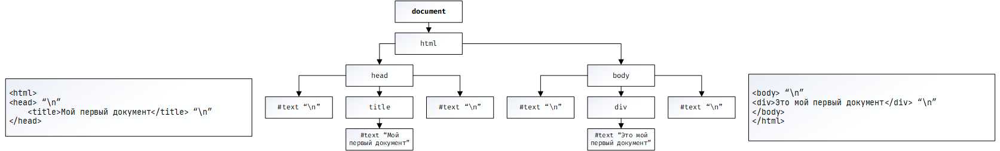
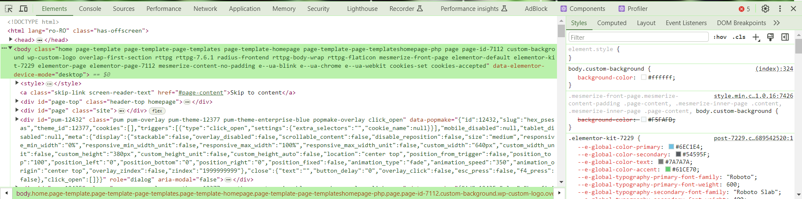

# Основы DOM-дерева

В данной главе мы подробнее рассмотрим взаимодействие с DOM.

DOM позволяет нам взаимодействовать с HTML-элементами и динамически их изменять.

Как мы поняли ранее, каждый из HTML-элементов для javascript является объектом.

## DOM-дерево

Вероятно, вы уже много раз слышали о **DOM-дереве**. Сам DOM представляет собой HTML-документ в виде древовидной структуры, именно поэтому оно и называется **DOM-деревом**.

Рассмотрим пример HTML-разметки.

```html
<html>
<head>
    <title>Мой первый документ</title>
</head>
<body>
<div>Это мой первый документ</div>
</body>
</html>
```




Каждый узел DOM-дерева представляет собой объект.

> [!TIP]
> Текст внутри элементов формирует текстовые узлы. Таким образом, текст также является узлом.

На самом деле выше приведена упрощенная схема DOM-дерева. Фактически, если в HTML-разметке (_в HTML-файле_) есть переход на новую строку, это также считается текстовым узлом, содержащим символ новой строки `\n`. Однако **данные элементы не отображаются обычному пользователю**.



Если весь HTML написать в одну строчку, такие элементы не будут созданы. Их обычно не учитывают при построении DOM-дерева. Поэтому в дальнейшем мы будем опускать `\n`, чтобы избежать путаницы.

## Инструменты разработчика

Для просмотра DOM-дерева и выполнения JS-команд на странице разработчики часто обращаются к инструментам разработчика.

Эти инструменты представляют собой панель, доступную в браузерах, которая позволяет более детально изучить структуру документа и выполнять JavaScript.

Обычно, для того, чтоб открыть инструменты разработчика используется клавиша `F12`.



Чтобы открыть консоль для выполнения JavaScript, перейдите на вкладку `Console`.