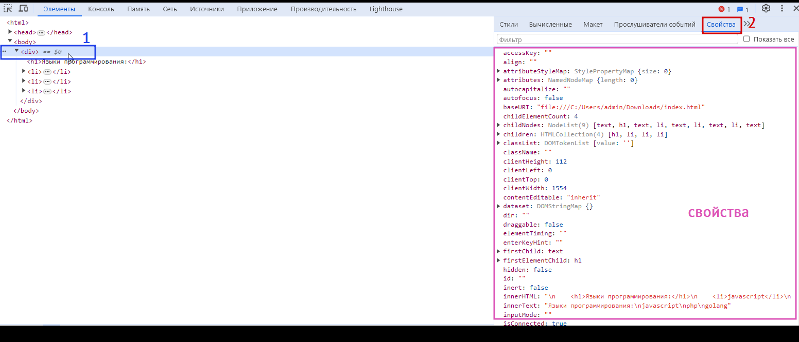

# Свойства элементов

После того как мы научились получать элементы со страницы, мы должны научиться ими управлять, то есть менять их свойства или вызывать их методы.

## Иерархия элементов

Думаете ли вы, что элементы `<a>` и `<input>` будут иметь разные свойства? Ответ: да и нет. 

С одной стороны, у этих элементов есть общие свойства, но с другой стороны, каждый элемент имеет свои уникальные характеристики. Например, элемент `<input>` может содержать свойство, отображающее текст, введенный пользователем.

Каждый DOM-элемент принадлежит определенному классу.

Иерархия наследования классов DOM-элементов выглядит следующим образом.


_(схема взята с веб-ресурса learn.javascript)_

* `EventTarget` - абстрактный корневой класс, который служит основой для событий.
    * `Node` - абстрактный класс, включающий функции `childNodes`, `parentNode`, `nextSiblings`, и другие.
        * `Document` - представляет весь документ в целом. Содержит свойства и методы, позволяющие работать со всем документом.
        * `Element` - базовый класс для DOM-элементов. Включает методы, такие как `querySelector`, `getElementById`, `nextElementSibling`, и другие.
            * `HTMLElement`
                * `HTMLInputElement` - класс для тега `<input>`
                * `HTMLAnchorElement` - класс для тега `<a>`
                * и так далее...
        * `CharacterData` - абстрактный класс для текста и комментариев.
            * `Text` - класс для текстовых узлов внутри элементов.
            * `Comment` - класс для комментариев (комментарии также являются частями DOM).

Таким образом, элемент `<a>` включает свойства классов `HTMLAnchorElement`, `HTMLElement`, `Element`, `Node` и `EventTarget`.

Более подробную информацию о всех этих свойствах вы можете найти на сайте спецификации JavaScript. Например, для элемента `<a>` вы можете посетить [ссылку](https://html.spec.whatwg.org/multipage/semantics.html#htmlanchorelement).

Рассмотрим несколько важных свойств элементов.

## Свойства элементов

### `nodeName`

> [!NOTE]
> `nodeName` возвращает имя узла.

```js
document.body.nodeName; // BODY
```

### `innerHTML`

Наиважнейшим свойством, которым вы часто будете пользоваться, является `innerHTML`.

> [!NOTE]
> `innerHTML` — HTML-содержимое элемента.

С помощью этого свойства мы можем изменять HTML-содержимое элементов и страницы в целом.

Давайте рассмотрим разметку:

```html
<div id="myDiv">
    <ul>
        <li>One</li>
        <li>Two</li>
        <li>Three</li>
    </ul>
</div>
```

```js
const divEl = document.querySelector("#myDiv");

console.log(divEl.innerHTML); // <ul><li>One</li><li>Two</li><li>Three</li></ul>

divEl.innerHTML = "<b>Hello</b>"
```

После изменения HTML-разметка станет следующей:
```html
<div id="myDiv">
    <b>Hello</b>
</div>
```
Для добавления контента к содержимому элемента используется оператор `+=`.

```js
const divEl = document.querySelector("#myDiv");

console.log(divEl.innerHTML); // <ul><li>One</li><li>Two</li><li>Three</li></ul>

divEl.innerHTML += "<b>Hello</b>"

console.log(divEl.innerHTML); // <ul><li>One</li><li>Two</li><li>Three</li></ul><b>Hello</b>
```

### `outerHTML`

> [!NOTE]
> `outerHTML` похож на `innerHTML`, но включает и сам элемент.

```js
const divEl = document.querySelector("#myDiv");

// <ul><li>One</li><li>Two</li><li>Three</li></ul>
console.log(divEl.innerHTML);

// <div id="myDiv"><ul><li>One</li><li>Two</li><li>Three</li></ul></div>
console.log(divEl.outerHTML); 
```

### `textContent`

> [!NOTE]
> `textContent` предоставляет доступ к тексту, находящемуся внутри элемента, и исключает теги.

```html
<div>
    <h1>Языки программирования:</h1>
    <li>javascript</li>
    <li>php</li>
    <li>golang</li>
</div>
```

```js
const divEl = document.querySelector("div");

// Выводит: Языки программирования: javascript php golang
console.log(divEl.textContent); 
```

Это свойство также можно изменять.

### `value`

> [!NOTE]
> Свойство `value` применимо к элементам формы, таким как теги `<input>` и `<select>`, и позволяет получить или установить содержимое.

```html
<input id="username" type="text"/>
```

```js
const inputEl = document.querySelector("#username");
const value = inputEl.value;
inputEl.value = "myName";
```

### `id`

> [!NOTE]
> Свойство `id` возвращает идентификатор элемента или пустую строку, если идентификатор не указан.

## А где найти все свойства?

HTML-элементы содержат множество различных свойств, их около сотни, и описывать их все нет смысла. Вы можете изучить их, выбрав на элемент в инструментах разработчика и открыв вкладку `свойства` или обратившись к [спецификации JS](https://html.spec.whatwg.org/#htmlinputelement).

