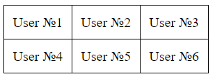

# Делегирование событий

Одной из ключевых концепций событий в JavaScript является делегирование. Предположим, у нас есть много элементов, на которые мы хотим назначить одно и то же событие. 

Вместо того чтобы назначать это событие каждому отдельному элементу, мы можем назначить его их общему предку.

Рассмотрим **пример**.

На веб-странице представлена таблица с пользователями. При щелчке по ячейке необходимо выполнить определенные действия и выделить ее. При выборе другой ячейки также следует выполнить определенную логику и выделить эту ячейку. Например, отобразить имя пользователя.

**Желаемый результат**:




```html
<!DOCTYPE html>
<html lang="en">
<head>
    <meta charset="UTF-8"/>
    <title>Users</title>
    <style>
        table {
            border-collapse: collapse;
        }

        td {
            border: 1px solid black;
            padding: 10px;
        }
    </style>
</head>
<body>
<table>
    <tr>
        <td>User №1</td>
        <td>User №2</td>
        <td>User №3</td>
    </tr>
    <tr>
        <td>User №4</td>
        <td>User №5</td>
        <td>User №6</td>
    </tr>
</table>
<script src="./index.js"></script>
</body>
</html>
```

Как можно заметить, в данной таблице всего 6 ячеек, однако они могут динамически изменяться. Привязывать событие на каждую ячейку будет _плохой практикой_.

Использование обработчика на общем родителе `<table>` вместо назначения обработчика на каждую ячейку является более предпочтительным подходом.

Такой обработчик может использовать `event.target` для определения, на какой именно ячейке произошло событие клика.

```js
// Переменная, в которой будет храниться ссылка на выделенный элемент
let selected;

// Добавление обработчика события "click" к таблице
document.querySelector("table").addEventListener("click", function (e) {
    // Проверка, является ли элемент, по которому было совершено событие, ячейкой таблицы
    if (e.target.tagName !== "TD") {
        return; // Если не является, завершаем выполнение функции
    }

    // Сохранение ссылки на ячейку таблицы, по которой было совершено событие
    // Переменная e.target хранит ссылку на элемент, который инициировал событие клика в момент его возникновения. 
    // В данном случае `td` будет ячейка, на которую мы кликнули
    let td = e.target;

    // Если уже есть выделенный элемент
    if (selected) {
        selected.style.backgroundColor = ""; // Сброс цвета фона выделенного элемента
    }

    // Сохранение ссылки на текущую выделенную ячейку
    selected = td;

    // Установка желтого цвета фона для выделенной ячейки
    td.style.backgroundColor = "yellow";

    // Изменение содержимого элемента с id "username" на текст выделенной ячейки
    document.querySelector("#username").innerHTML = td.textContent;
});
```

Почему это работает? Почему при клике на `<td>` вызывается событие `<table>`? Все дело во **всплытии событий**, о котором мы говорили в [прошлой главе](112_events_ascent.md). То есть при клике на `<td>` вызываются события предков и соответственно событие `<table>`.

Появляется проблема, что если в `<td>` у нас есть другой элемент, например, `<p>`, то при нажатии на него будет выделиться он. _Как думаете как решить данную проблему?_

```html
<td>
    <p>User №1</p>
</td>
```

Рассмотрим еще один пример.

На странице у нас есть несколько счетчиков. Как можно сделать так, чтобы не приходилось назначать обработчик события на каждый из них? Попробуйте сделать сами.

```html
<!DOCTYPE html>
<html lang="en">
  <head>
    <meta charset="UTF-8" />
    <title>Counters</title>
  </head>
  <body>
    <div id="counter">
      <input type="button" value="1" />
      <input type="button" value="1" />
    </div>
    <script src="./index.js"></script>
  </body>
</html>
```

Попробуйте повесить сначала обработчик на элемент `.counter`, а потом на элемент `document`. 

> [!NOTE]
> В реальном проекте вполне естественно иметь множество обработчиков событий, назначенных на элемент `document`, и это является общепринятой практикой. Обработчики событий могут быть установлены из различных частей кода, что позволяет организовать структуру проекта более гибко и модульно.