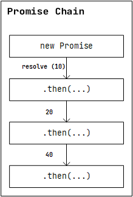

# Цепочка промисов

Рассмотрим ситуацию, когда у нас имеется некоторый ряд асинхронных задач, которые должна быть выполнена одна за другой.

С одной стороны нет ничего сложного. Второй промис можно разрешить внутри первого `then`, третий промис, внутри второго и так далее.

```js
function asyncTask1() {
    return new Promise(resolve => setTimeout(() => resolve(asyncTask2), 1000));
}

function asyncTask2() {
    return new Promise(resolve => setTimeout(() => resolve(asyncTask3), 1000));
}

function asyncTask3() {
    return new Promise(resolve => setTimeout(() => resolve('Task 3'), 1000));
}

asyncTask1().then(result => {
    result().then(result => {
        result().then(result => console.log(result)); // Task 3
    })
})
```

Но в данном случае возникает ситуация, известная как "callback hell", что означает слишком много вложенности, и является плохой практикой.

В данном случае используется "цепочка промисов", которая позволяет последовательно связывать выполнение асинхронных операций, избегая так называемого "**callback hell**" и делая код более читаемым и управляемым.

Рассмотрим вариант выше.
```js
asyncTask1().then(result => {
    return result();
}).then(result => {
    return result();
}).then(result => {
    consolr.log(result);
})
```

Таким образом, каждый промис в цепочке `then` получает результат предыдущего промиса в качестве аргумента, что обеспечивает последовательное выполнение асинхронных операций без создания глубокой вложенности.

Это работает не только с промисами, но и с другими значениями, которые возвращаются из предыдущих функций обратного вызова в цепочке `then`.
```js
function getInfo() {
    return new Promise((resolve, reject) => {
        setTimeout(() => resolve(10), 1000)
    })
}

getInfo().then(result => { // result = 10
    return result * 2; // result = 20
}).then(result => { // result = 20
    return result * 2; // result = 40
}).then(result => { // result = 40
    console.log(result); // 40
})
```

Здесь каждый вызов `then` получает результат предыдущего вычисления и выполняет операции над ним, что позволяет легко и последовательно манипулировать данными в асинхронном контексте.

Схематично это можно изобразить следующим образом.

<span style="text-align:center"></span>

Данная логика работает, так как функция `then` также возвращает промис, который разрешается с возвращаемым значением.

```js
getInfo().then(result => { 
    return result * 2; // вернулся промис с resolve(result * 2) 
}).then(result => { 
    return result * 2; // вернулся промис с resolve (result * 2)
}).then(result => { 
    console.log(result); 
})
```